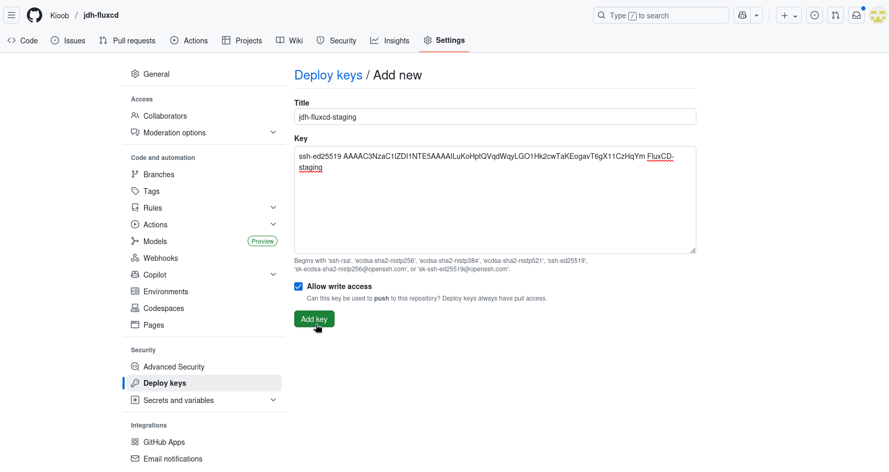

# FluxCD du JournalDuHacker

FluxCD est utilisé pour maintenir en conformité l'infra du JournalDuHacker.
Ce dépôt sert de source de vérité quant à la configuration et au contenu des
environnements de production et staging.

## Workflow

Pour éviter des fausses manips, ou encore faciliter les tests, nous travaillons
principalement sur deux branches :

* `main` : branche principale pour les modifications de production
* `develop` : branche pour les modifications de staging

L'idée étant de tester sur staging, puis de fusionner (via `pull request` ou
`merge request`) vers la branche `main`.

## Arborescence

Le point d'entrée pour FluxCD est le fichier `clusters/$env/main.yaml`.
Il contient les premiers «includes» vers les autres fichiers Kustomize.

La convention choisie :

* `/app`: contient la description des différentes applications utilisées pour
          le bon fonctionnement des services.
* `/infra`: contient les composants plus internes au cluster (CRDs et operators),
          qui doivent être déployés avant les applications.

Puis pour les applications :

* `/app/$appname/base/$kind-$name.yaml` : décrit les composants de l'application
          `$appname`, communs à tous les environnements.
* `/app/$appname/$environnement/$kind-$name.yaml` : décrit les composants de
          l'application, spécifiques à chaque environnements.


## Bootstrap & mise à jour

À titre informatif, au cas où vous souhaiteriez mettre à jour fluxcd ou bien le
déplacer ailleurs (changement de dépôt Git source, changement de branche,
changement de méthode d'auth, ou encore changement de cluster Kubernetes cible),
voici la procédure qui a été utilisé, et qu'on peut répéter.

Cette procédure est à lancer depuis un environnement (par exemple votre poste)
ayant un «kube config» valide, et pointant vers la prod (probablement vérifiable
via un `kubectl get nodes`).


### Identification par clé SSH

Afin de contourner les problématiques d'expiration de Token Github/Gitlab, nous
utilisons une auth SSH.

```
$ ssh-keygen -t ed25519 -N "" -C FluxCD-staging -f ./fluxcd-ssh-staging
```

Cette clé doit être déclarer sur GitHub comme clé de déploiement
(«Settings» -> «Deploy keys»). Cette clé doit avoir les droits d'écriture lors
du bootstrap, mais on peut lui retirer après ça.

Dans le cas de la staging, j'ai fait le choix de lui laisser les droits, ce qui
permet d'utiliser la même clé pour `ImageUpdater`.



### Installation de FluxCD

```
$ flux bootstrap git --url=ssh://git@github.com/JournalDuHacker/fluxcd.git \
    --components-extra=image-reflector-controller,image-automation-controller \
    --path=clusters/staging \
    --branch=develop \
    --private-key-file=./fluxcd-ssh-staging
```

NOTE: cette syntaxe n'accepte pas d'avoir le `:` dans le chemin du dépôt Git.
Si vous faites un copier/coller depuis GitHub ou GitLab, pensez à remplacer ce
`:` par `/`.

Vous devriez avoir un retour de ce genre, confirmant le bon fonctionnement :

```
► cloning branch "develop" from Git repository "ssh://git@github.com/Kioob/jdh-fluxcd.git"
✔ cloned repository
► generating component manifests
✔ generated component manifests
✔ committed component manifests to "develop" ("3e1db69d1b414e66a5a46f2cf080b93a9051329b")
► pushing component manifests to "ssh://git@github.com/Kioob/jdh-fluxcd.git"
► installing components in "flux-system" namespace
✔ installed components
✔ reconciled components
► determining if source secret "flux-system/flux-system" exists
► generating source secret
✔ public key: ssh-ed25519 AAAAC3NzaC1lZDI1NTE5AAAAILuKoHptQVqdWqyLGO1Hk2cwTaKEogavT6gX11CzHqYm
Please give the key access to your repository: y
► applying source secret "flux-system/flux-system"
✔ reconciled source secret
► generating sync manifests
✔ generated sync manifests
✔ committed sync manifests to "develop" ("ad82cae0e3028b8c5b886d21a19ffd4c9cb0522d")
► pushing sync manifests to "ssh://git@github.com/Kioob/jdh-fluxcd.git"
► applying sync manifests
✔ reconciled sync configuration
◎ waiting for GitRepository "flux-system/flux-system" to be reconciled
✔ GitRepository reconciled successfully
◎ waiting for Kustomization "flux-system/flux-system" to be reconciled
✔ Kustomization reconciled successfully
► confirming components are healthy
✔ helm-controller: deployment ready
✔ image-automation-controller: deployment ready
✔ image-reflector-controller: deployment ready
✔ kustomize-controller: deployment ready
✔ notification-controller: deployment ready
✔ source-controller: deployment ready
✔ all components are healthy
```

À partir de là, FluxCD est installé, et a commit-push dans la branche `develop`
du dépôt, dans le dossier `clusters/staging/flux-system`.

C'est là que vous pouvez retirer les droits d'écriture sur le dépôt, si vous
le souhaitez (cf explication au chapitre précédent).
